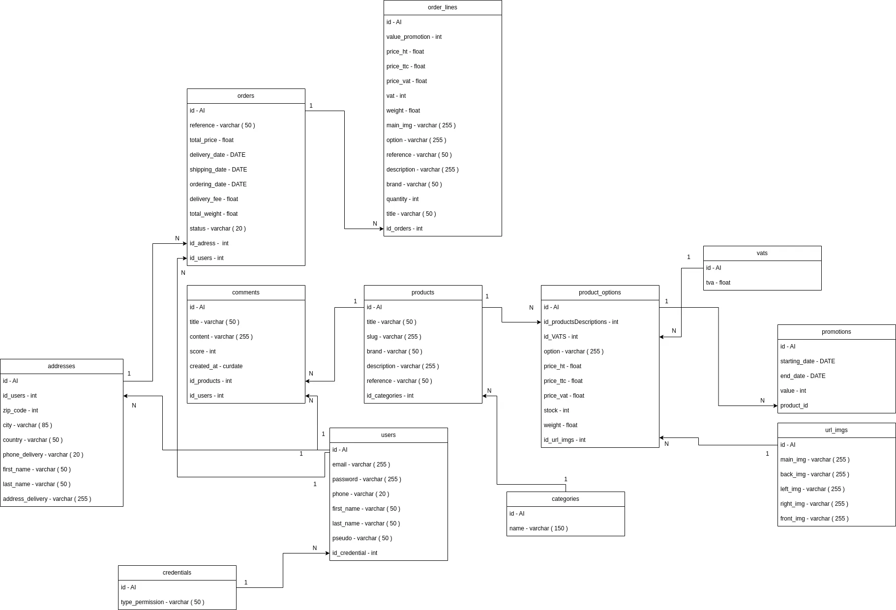

# Last man

Un site e-commerce spécialisé dans le domaine du bushcraft

## Context

C'est un magasin en ligne traditionnel, le propriétaire de la plateforme est responsable de la gestion des stocks, du service client, de la logistique, ...  
Lui et les administrateurs sont les seuls à pouvoir créer, supprimer ou modifié un article. Les visiteurs peuvent parcourir le site, mais ils devront se connecter pour finaliser la commande. Avec un compte les utilisateurs pourrons voir leurs historiques d'achat, suivre leurs articles, annulés leurs commandes, ainsi que mettre à jour les informations de leurs comptes.

Le client arrivera dans un premier temps sur la homepage, il y aura une barre de navigation pour facilité son expérience. Ainsi qu'un article mis en avant et les catégories. Depuis les catégories, le client pourra choisir son produit, le prix affiché sera l'option la moins chère. En effet, chaque produit a une ou plusieurs options avec des prix différents. Une fois sur la page produit, il pourra choisir l'option et la quantité, et l'ajouter au panier.

## Users stories

| Utilisateurs |     | Action | Catégorisation | Description | Value ( 1 / 2 / 3 / 5 / 8 ) | Cost ( 1 / 2 / 3 / 5 / 8 ) |
| --- | --- | --- | --- | --- | --- | --- |
| VISITEUR |     | VOIR TOUT LES PRODUITS |     |     |     |     |
|     |     |     | 1-A | Homepage -> toutes les catégories cliquable | 8   | 1   |
|     |     |     | 1-B | Catalogue -> liste des produits par ordre alphabetique | 8   | 1   |
| VISITEUR |     | VOIR UN PRODUIT EN DETAIL |     |     |     |     |
|     |     |     | 2-A | Information du produit ( nom / img / description / prix / vendeur ) | 8   | 2   |
|     |     |     | 2-B | Formulaire achat ( qte / btn ajouter panier ) | 8   | 3   |
|     |     |     | 2-C | Avis | 2   | 5   |
| VISITEUR |     | INSCRIPTION |     |     |     |     |
|     |     |     | 3-A | formulaire de connexion( email / mdp ) | 5   | 4   |
|     |     |     | 3-B | Inscription => remplir information user ( nom / prénom / age / adresse ) | 2   | 4   |
| VISITEUR |     | REMPLIR MON PANIER |     |     |     |     |
|     |     |     | 4-A | Creation de 'cart' dans session | 5   | 5   |
|     |     |     |     |     |     |     |
|     |     |     | 4-B | Ajout de la gestion des cookies pour le panier | 3   | 5   |
| VISITEUR |     | GERER MON PANIER |     |     |     |     |
|     |     |     | 5-A | Modifier la qte | 5   | 3   |
|     |     |     | 5-B | Supprimer un produit | 5   | 2   |
|     |     |     | 5-C | Valider la commande | 5   | 5   |
| VISITEUR |     | CHERCHER UN PRODUIT |     |     |     |     |
|     |     |     | 6-A | Formulaire de recherche dans la navbar | 3   | 5   |
|     |     |     | 6-B | Création d'une page associée à la recherche pour afficher les résultats | 3   | 3   |
|     |     |     | 6-C | Recherche dynamique | 2   | 8   |
| VISITEUR |     | AFFICHER UNE CATÉGORIE |     |     |     |     |
|     |     |     | 7-A |     | 2   | 3   |
|     |     |     | 7-B | Catalogue => produit par catégories | 2   | 5   |
|     |     |     | 7-C | Création de button pour recherche par catégorie - PAS PRÉVU DANS FIGMA | 2   | 5   |
| VISITEUR |     | ZONE FAQ/AVIS |     |     |     |     |
|     |     |     | 8-A | Création d'une page FAQ avec les 5 questions les plus fréquentes - PAS PRÉVU - FOOTER ??? | 2   | 1   |
| VISITEUR |     | PANIER PERMANENT |     |     |     |     |
|     |     |     | 9-A | Si panier existant et nouvelle connexion => redirection sur page panier | 1   | 8   |
|     |     |     |     |     |     |     |
|     |     |     |     |     |     |     |
| UTILISATEUR |     | ME CONNECTER A MON COMPTE |     |     |     |     |
|     |     |     | 10-A | Gestion de l'autoconnexion via les cookies | 2   | 5   |
|     |     |     | 10 - B | Pouvoir se connecter avec un formulaire simple (email /mdp) |     |     |
| UTILISATEUR |     | RÉGLER UNE COMMANDE / PAIEMENT |     |     |     |     |
|     |     |     | 11-A | Vérification des informations utilisateurs ( adresse / nom / email/ adresse/ code postal/ ville ) -> adresse de livraison possiblement différente de celle du client | 5   | 2   |
|     |     |     | 11-B | Vérification du stock | 5   | 2   |
|     |     |     | 11-C | Intégration Stripe | 8   | 8   |
| UTILISATEUR |     | LAISSER UN AVIS SUR UN PRODUIT ACHETÉ |     |     |     |     |
|     |     |     | 12-A | Si utilisateur connecté ajouter un commentaire à un produit | 3   | 3   |
|     |     |     | 12-B | Supprimer son commentaire | 2   | 3   |
|     |     |     | 12-C | Ajouter une note | 2   | 3   |
| UTILISATEUR | Back office Utilisateur | HISTORIQUE DES ACHATS/ FACTURES |     |     |     |     |
|     |     | 13-A | Page gestion des commandes achat dans page profil => Affiche toutes les commandes effectuées | 2   | 3   |     |
| UTILISATEUR | SUIVI DE COMMANDE |     |     |     |     |     |
|     |     | 14-A | Page gestion des commandes pour afficher les commandes qui ont une date de livraison < à la date actuelle | 3   | 3   |     |
| UTILISATEUR | ANNULER UNE COMMANDE |     |     |     |     |     |
|     |     | 15-A | page gestion des commandes suivi de commande => possibilté de supprimer la commande si date de commande < 48h | 3   | 3   |     |
|     |     | 16-B | Ajouter un bouton pour charger plus de commandes | 3   | 2   |     |
| UTILISATEUR | MODIFIER MON COMPTE |     |     |     |     |     |
|     |     | 17-A | Création d'un formulaire avec récupération des données de l'utilisateur pour lui afficher et btn pour valider la modification | 2   | 2   |     |
| UTILISATEUR |     | CONTACT SAV |     |     |     |     |
|     |     |     | 16-A | ajouter un link de type mail dans le footer | 3   | 1   |
|     |     |     |     |     |     |     |
|     |     |     |     |     |     |     |
| ADMIN |     | Page d'admin |     |     |     |     |
|     |     |     | 24-A | Creation de la page back office => idem page user | 3   | 3   |
| ADMIN |     | Gestion produit |     |     |     |     |
|     |     |     | 25-A | Lister tous les produits | 3   | 3   |
|     |     |     | 25-B | Ajouter un bouton modifier sur les produits avec redirection vers une page formulaire | 3   | 3   |
|     |     |     | 25-C | Ajouter bouton supprimer un produit | 3   | 2   |
|     |     |     | 25-D | Ajouter un bouton pour ajouter un produit => redirection vers un formulaire de création ( nom / description / prix / img ) | 3   | 3   |
|     |     |     | 25-E | CRUD table promotion => % de remise et date de début et fin de la promotion | 3   | 3   |
| ADMIN |     | Gestion users |     |     |     |     |
|     |     |     | 26-A | Lister tous les users | 3   | 3   |
|     |     |     |     |     |     |     |
|     |     |     | 26-C | Modifier un User | 3   | 3   |
|     |     |     | 26-D | Créer un User | 3   | 3   |
|     |     |     | 26-E | Supprimer un user | 3   | 3   |
|     |     |     |     |     |     |     |
| ADMIN |     | Gestion catégorie |     |     |     |     |
|     |     |     | 27-A | Lister toutes les catégories | 3   | 3   |
|     |     |     | 27-B | Ajouter une catégories | 3   | 3   |
|     |     |     | 27-C | Modifier une catégorie | 3   | 3   |
|     |     |     | 27-D | Supprimer une catégories | 3   | 2   |
| ADMIN |     | Gestion des avis |     |     |     |     |
|     |     |     | 28-A | Supprimer des avis | 3   | 3   |
|     |     |     | 28-B | Ajouter un modal d'avertissement d'avis non conventionnel | 2   | 3   |
|     |     |     |     |     |     |     |
|     |     |     |     |     |     |     |

| USER STORIES VISITEURS |
| --- |
| Je veux pouvoir voir tout les produits - 1 |
|     |
| Titre |
| Avoir une homepage avec toutes les catégories cliquables - A |
| Avoir une page catalogue des produits de la catégorie en question - B |
| TOTAL |
|     |
| Je veux pouvoir voir un produit en détail - 2 |
|     |
| Titre |
| Pouvoir voir les informations du produit (nom / img / description / prix / vendeur) - A |
| Il faut un formulaire d'achat (qté / boutton ajouter panier) - B |
| Il faut pouvoir voir les avis de ce produit - C |
| TOTAL |
|     |
| Je veux pouvoir m'inscrire - 3 |
|     |
| Titre |
| Il faut un formulaire d'inscription (nom / prénom / âge / adresse) - A |
| TOTAL |
|     |
|     |
|     |
| Je veux pouvoir remplir mon panier - 4 |
|     |
| Titre |
| Il faut un 'cart' dans la session - A |
| Ajouter la gestion de cookies pour le panier - B |
| TOTAL |
|     |
|     |
| Je veux pouvoir gérer mon panier - 5 |
|     |
| Titre |
| Modifier la quantité d'un produit - A |
| Supprimer un produit - B |
| Valider la commande - C |
| TOTAL |
|     |
|     |
| Je veux pouvoir chercher un produit - 6 |
|     |
| Titre |
| Il faut un formulaire de recherche dans la navbar - A |
| Création d'une page associé à la recherche pour afficher les résultats - B |
| Il faut que la r"echerche sois dynamique - C |
| TOTAL |
|     |
|     |
| Je veux pouvoir afficher tous les produits d'une catégorie - 7 |
|     |
| Titre |
| Il faut voir tous les produits d'une catégorie, avec un nombre défini par pages - A |
| TOTAL |
|     |
|     |
| Je veux pouvoir avoir accès à une page FAQ - 8 |
|     |
| Titre |
| Il faut une page FAQ avec au moins les 5 questions les plus fréquentes et leurs réponses - A |
| TOTAL |
|     |
|     |
| Je veux que mon panier sois conservé même si je quitte le site et revient - 9 |
|     |
| Titre |
| Il faut que le panier sois conservé par rapport au compte de la personne, et sinon selon une durée limité en cookie - A |
| TOTAL |

| USER STORIES UTILISATEURS |
| --- |
| Je veux pouvoir me connecter à mon compte - 10 |
|     |
| Titre |
| Il faut que les cookies puissent gérer l'autoconnexion - A |
| Il faut pouvoir se connecter avec un formulaire simple (email/mdp) - B |
| TOTAL |
|     |
|     |
| Je veux pouvoir régler une commande - 11 |
|     |
| Titre |
| Il faut pouvoir vérifier les informations utilisateurs (adresse / nom / email / code postale / ville) - A |
| On doit vérifier les stocks avant d'accéder au paiement - B |
| Il faut avoir intégrer Stripe - C |
| TOTAL |
|     |
|     |
| Je veux pouvoir laisser un avis sur un produit que j'ai acheté - 12 |
|     |
| Titre |
| Il faut pouvoir ajouter un commentaire à un produit - A |
| I faut pouvoir supprimer son commentaire - B |
| On doit pouvoir ajouter une note avec le commentaire - C |
| TOTAL |
|     |
|     |
| Je veux pouvoir suivre/ anuler mes commandes - 13 |
|     |
| Titre |
| Il faut une page suivi de commande pour afficher les commandes qui ont une date < date actuelle - A |
| Il faut un bouton pour annuler une commande en cours si la date de commande < 48h - B |
| Il faut gérer l'affichage du nombre de commandes affichées par page - C |
| TOTAL |
|     |
|     |
| Je veux pouvoir voir mon historique d'achats / Mes factures - 14 |
|     |
| Titre |
| Il faut une page suivi de commande pour afficher les coommandes qui ont une date < date actuelle - A |
| TOTAL |
|     |
|     |
| Je veux pouvoir modifier mon compte - 15 |
|     |
| Titre |
| Il faut un formulaire de changement d'information du compte si personne déjà connecté - A |
| TOTAL |
|     |
|     |
| Je veux pouvoir contacter le SAV en cas de besoin - 16 |
|     |
| Titre |
| Il faut un link de type mail dans le footer pour cela - A |
| TOTAL |

## Authorization

| Autorization | Admin | User | Visitor |
| --- | --- | --- | --- |
| Display products | x   | x   | x   |
| Add product to cart | x   | x   | x   |
| Display own cart | x   | x   | x   |
| Edit cart | x   | x   | x   |
| Validate cart | x   | x   |     |
| Display register page | x   | x   | x   |
| Display login page | x   | x   | x   |
| Display & edit profile page | x   | x   |     |
| Display order history | x   | x   |     |
| Cancel current order | x   | x   |     |
| Access to the admin dashboard | x   |     |     |
| Create & Edit & Delete a category | x   |     |     |
| Create & Edit & Delete a product | x   |     |     |
| Create & Edit & Delete a product option | x   |     |     |

## Endpoints

| Endpoint | Méthode | Contrôleur | Action |
| --- | --- | --- | --- |
| /   | GET | HomePageController | index |
| /products/{id} | GET | ProductController | show |
| /{categoryId} | GET | ProductController | index |
| /search | GET | SearchController | getProducts |
| /addToCart/{id} | POST | AddProductController | addCart |
| /dashboard | GET | DashboardController | index |

## Datamodel

### addresses

- id: char(36) NOT NULL
- user_id: char(36) NOT NULL
- zip_code: int(11) NOT NULL
- city: varchar(120) NOT NULL
- country: varchar(120) NOT NULL
- phone_delivery: varchar(20) NOT NULL
- first_name: varchar(50) NOT NULL
- last_name: varchar(50) NOT NULL
- address_delivery: varchar(255) NOT NULL
- created_at: timestamp NULL DEFAULT NULL
- updated_at: timestamp NULL DEFAULT NULL

### categories

- id: char(36) NOT NULL
- created_at: timestamp NULL DEFAULT NULL
- updated_at: timestamp NULL DEFAULT NULL
- name: varchar(255) NOT NULL
- img: varchar(255) DEFAULT NULL
- slug: varchar(255) NOT NULL

### comments

- id: char(36) NOT NULL
- content: varchar(255) NOT NULL
- score: int(11) NOT NULL
- user_id: char(36) NOT NULL
- product_id: char(36) NOT NULL
- created_at: timestamp NULL DEFAULT NULL
- updated_at: timestamp NULL DEFAULT NULL

### credentials

- id: char(36) NOT NULL
- type_permission: varchar(50) NOT NULL
- created_at: timestamp NULL DEFAULT NULL
- updated_at: timestamp NULL DEFAULT NULL

### orders

- id: char(36) NOT NULL
- reference: varchar(50) NOT NULL
- total_price: double(8,2) NOT NULL
- delivery_date: date DEFAULT NULL
- shipping_date: date DEFAULT NULL
- ordering_date: date NOT NULL
- delivery_fee: double(4,2) NOT NULL
- total_weight: double(8,2) NOT NULL
- status: varchar(20) NOT NULL
- address_id: char(36) NOT NULL
- user_id: char(36) NOT NULL
- created_at: timestamp NULL DEFAULT NULL
- updated_at: timestamp NULL DEFAULT NULL

### order_lines

- id: char(36) NOT NULL
- order_id: char(36) NOT NULL
- option: varchar(255) NOT NULL
- reference: varchar(255) NOT NULL
- description: varchar(255) NOT NULL
- main_img: varchar(255) NOT NULL
- brand: varchar(50) NOT NULL
- price_ht: double(8,2) NOT NULL
- price_ttc: double(8,2) NOT NULL
- price_vat: double(8,2) NOT NULL
- weight: double(8,2) NOT NULL
- quantity: int(11) NOT NULL
- vat: double(8,2) NOT NULL
- value_promotion: int(11) NOT NULL
- created_at: timestamp NULL DEFAULT NULL
- updated_at: timestamp NULL DEFAULT NULL

### products

- id: char(36) NOT NULL
- created_at: timestamp NULL DEFAULT NULL
- updated_at: timestamp NULL DEFAULT NULL
- name: varchar(255) NOT NULL
- description: varchar(255) NOT NULL
- reference: varchar(255) NOT NULL
- slug: varchar(255) NOT NULL
- brand: varchar(255) NOT NULL
- category_id: char(36) NOT NULL

### product_options

- id: char(36) NOT NULL
- product_id: char(36) NOT NULL
- vat_id: char(36) NOT NULL
- url_img_id: char(36) NOT NULL
- option: varchar(255) NOT NULL
- price_ht: double(8,2) NOT NULL
- price_ttc: double(8,2) NOT NULL
- price_vat: double(8,2) NOT NULL
- weight: double(8,2) NOT NULL
- stock: int(11) NOT NULL

### promotions

- id: char(36) NOT NULL
- starting_date: datetime NOT NULL
- end_date: datetime NOT NULL
- value: int(11) NOT NULL
- created_at: timestamp NULL DEFAULT NULL
- updated_at: timestamp NULL DEFAULT NULL
- product_option_id: char(36) NOT NULL

### url_imgs

- id: char(36) NOT NULL
- main_img: varchar(255) NOT NULL
- back_img: varchar(255) NOT NULL
- left_img: varchar(255) NOT NULL
- right_img: varchar(255) NOT NULL
- front_img: varchar(255) NOT NULL

### users

- id: char(36) NOT NULL
- credential_id: char(36) NOT NULL
- first_name: varchar(255) DEFAULT NULL
- name: varchar(255) DEFAULT NULL
- pseudo: varchar(255) DEFAULT NULL
- phone: varchar(255) DEFAULT NULL
- email: varchar(255) NOT NULL
- email_verified_at: timestamp NOT NULL DEFAULT current_timestamp() ON UPDATE current_timestamp()
- password: varchar(255) NOT NULL
- remember_token: varchar(100) DEFAULT NULL
- created_at: timestamp NULL DEFAULT NULL
- updated_at: timestamp NULL DEFAULT NULL

### vats

- id: char(36) NOT NULL
- vat: double(8,2) NOT NULL
- created_at: timestamp NULL DEFAULT NULL
- updated_at: timestamp NULL DEFAULT NULL

### Foreign Keys

- `addresses_user_id_foreign`: references `users` (`id`)
- `comments_product_id_foreign`: references `products` (`id`)
- `comments_user_id_foreign`: references `users` (`id`)
- `orders_address_id_foreign`: references `addresses` (`id`)
- `orders_user_id_foreign`: references `users` (`id`)
- `order_lines_order_id_foreign`: references `orders` (`id`)
- `products_category_id_foreign`: references `categories` (`id`)
- `product_options_product_id_foreign`: references `products` (`id`)
- `product_options_url_img_id_foreign`: references `url_imgs` (`id`)
- `product_options_vat_id_foreign`: references `vats` (`id`)
- `promotions_product_option_id_foreign`: references `product_options` (`id`)
- `users_credential_id_foreign`: references `credentials` (`id`)

## Diagram BDD

